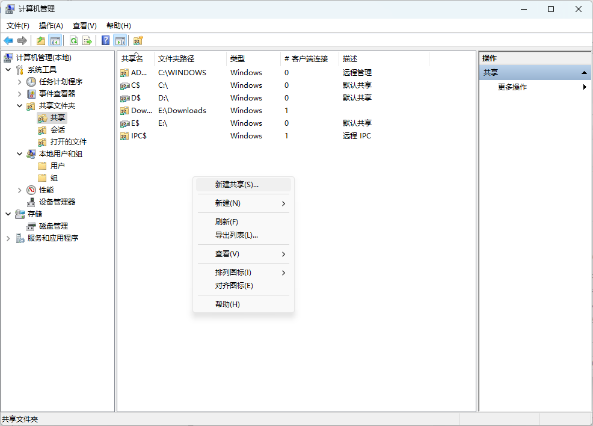
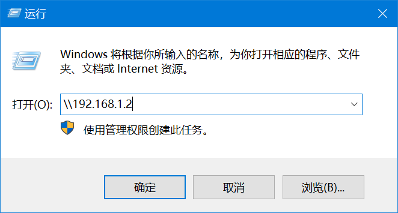
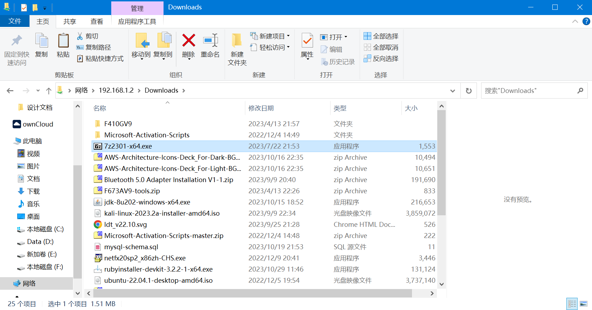

## 1.新建共享用户

首先，按下 Windows 键，搜索“计算机管理”应用，点击打开应用。

然后，依次展开计算机管理->系统工具->本地用户和组->用户，右键创建新用户：

最后，我们输入用户名和密码为 smb 完成新用户的创建：

## 2.创建共享文件夹

接着，我们依次展开计算机管理->系统工具->共享文件夹->共享，我们创建一个共享文件夹：

然后，我们选择需要共享的文件夹“E:\Videos”，然后根据向导点击完成共享文件夹的创建：

## 3.添加共享文件夹访问权限

最后，我们右键共享的属性，查看 Videos 共享的属性：

点击切换到共享权限页签，并点击添加按钮添加用户或组：

接着我们，输入步骤2创建 smb 用户名，并点击检查名称：

## 4.验证
至此，通过以上3个步骤我们已完成 Window 11 下的文件共享设置。现在让我们使用局域网内另外一台主机访问共享存储，我们在另外一台主机上打开运行窗口，输入 `\\192.168.1.2` 命令，如下图：

点击确定后，我们可以访问到目标主机设置的共享目录，并且能在共享文件夹上传和下载文件。

## 5.总结

在 Windows 11 中，开启共享后，使用的主要协议是 SMB（Server Message Block）。SMB 是一种网络通信协议，主要用于在不同的计算机之间共享文件和打印机资源。它是 Windows 操作系统中的一种内置协议，也广泛应用于 Linux 和 Unix 系统。

当你在 Windows 11 中设置共享文件夹时，系统会默认使用 SMB 协议将文件夹分享给其他用户。SMB 协议支持多种权限设置，如只读、读写等，可以根据需要灵活配置。

此外，Windows 11 还支持其他网络协议，如 NFS（Network File System）和 AFP（Apple File Protocol），以满足不同场景的需求。但一般来说，SMB 协议在企业级应用中更为常见，因为它具有较好的性能和安全性。