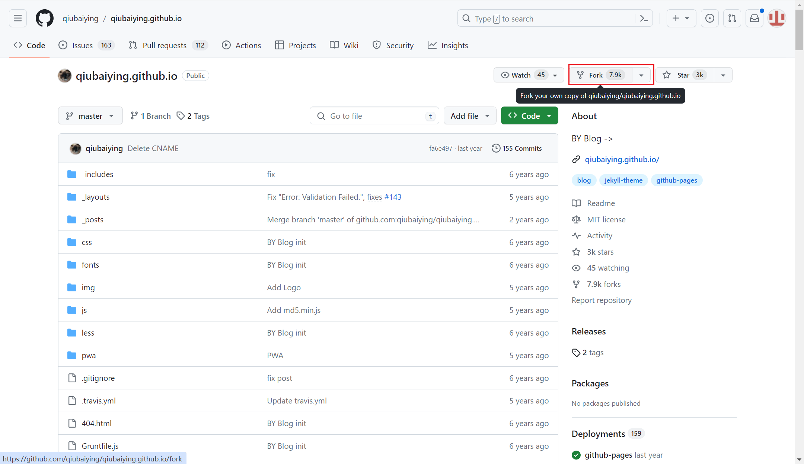
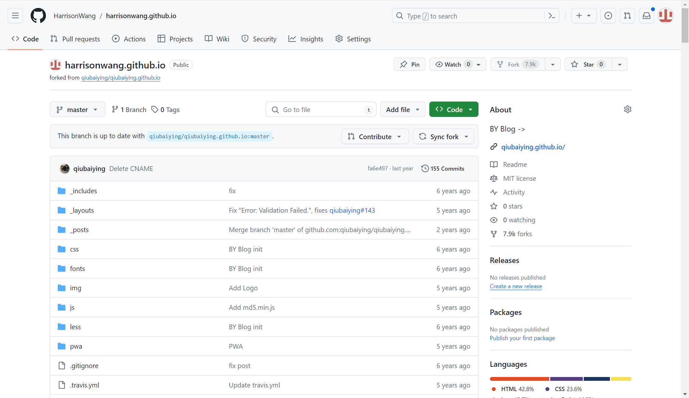

## 1.环境准备

安装 Ruby：

```bash
$ apt install ruby-dev
```

查看当前 RubyGems 源：

```bash
$ gem source -l
```

更换 RubyGems 源：

```bash
$ gem sources --add https://mirrors.tuna.tsinghua.edu.cn/rubygems --remove https://rubygems.org/
```

配置 bundle 源：
```bash
$ bundle config mirror.https://rubygems.org https://mirrors.tuna.tsinghua.edu.cn/rubygems
```

清空和更新源缓存：

```bash
$ gem sources -c

$ gem sources -u
```

安装 Jekyll 和 Bundler ：

```bash
# 查看安装日志
$ gem install jekyll --verbose

$ gem install jekyll bundler
```

## 2.Fork 仓库

打开 https://github.com/qiubaiying/qiubaiying.github.io 开源的博客仓库，fork 到个人仓库：



修改仓库名称为 `GitHub账号.github.io`，然后点击 Create fork：


Fork 完成后仓库如下：



## 3.本地调试

克隆代码仓库到本地：

```bash
$ git clone https://github.com/HarrisonWang/harrisonwang.github.io.git
```

执行以下命令启动：

```bash
$ jekyll s
```

打开 http://127.0.0.1:4000/ 地址预览效果如下：


可以看到首页文章列表未显示，这是因为此博客仓库是基于 Jekyll 2 开始构建的，当时 `jekyll-paginate` 已成为标准。对于 Jekyll 4，它只是一个插件，所以我们需要配置和安装它。编辑 _config.yml 文件，添加 `jekyll-paginate` 插件配置：

```yaml
plugins: [jekyll-paginate]
```

然后，使用以下命令安装该 `jekyll-paginate` 插件：

```bash
$ sudo gem install jekyll-paginate
```

我们使用 `jekyll s` 命令重启后，强制刷新下页面，可以看到首页文章已能正常显示。


## 4.问题

`jekyll s` 命令启动时，`_layouts` 文件夹下的 `post.html` 和 `page.html` 会报类似如下错误信息：

```bash
$ jekyll s
Configuration file: /home/wss/project/harrisonwang.github.io/_config.yml
            Source: /home/wss/project/harrisonwang.github.io
       Destination: /home/wss/project/harrisonwang.github.io/_site
 Incremental build: disabled. Enable with --incremental
      Generating... 
    Liquid Warning: Liquid syntax error (line 145): Unexpected character { in "tag[1].size > {{site.featured-condition-size}}" in /home/wss/project/harrisonwang.github.io/_layouts/post.html
    Liquid Warning: Liquid syntax error (line 38): Unexpected character { in "tag[1].size > {{site.featured-condition-size}}" in /home/wss/project/harrisonwang.github.io/_layouts/page.html
    Liquid Warning: Liquid syntax error (line 87): Unexpected character { in "tag[1].size > {{site.featured-condition-size}}" in /home/wss/project/harrisonwang.github.io/_layouts/page.html
                    done in 0.141 seconds.
 Auto-regeneration: enabled for '/home/wss/project/harrisonwang.github.io'
    Server address: http://127.0.0.1:4000/
  Server running... press ctrl-c to stop.
```

根据提示信息，我们定位到 `post.html` 中的第 145 行，以及 `page.html` 中的第 38 和 87 行，找到下面的代码，将其中的双层花括号删除：

```
tag[1].size > {{site.featured-condition-size}}
```

改为：

```
tag[1].size > site.featured-condition-size
```

## 5.Typora 写文章图片路径问题

