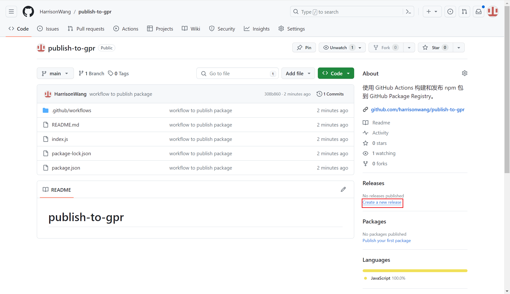
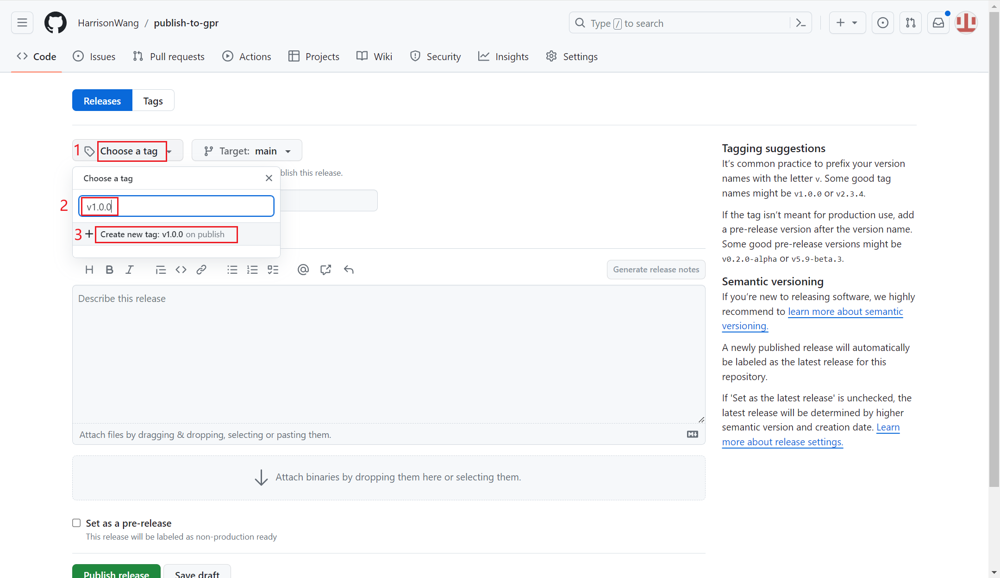
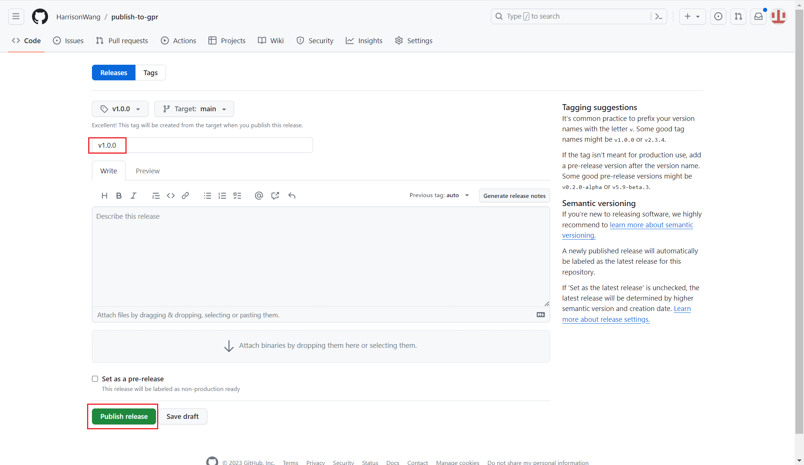
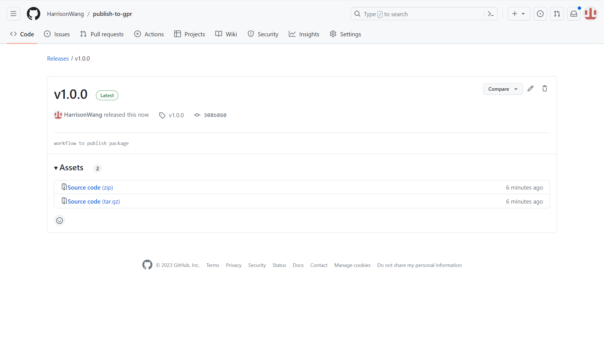

本文将指导您在 GitHub Packages 上构建和发布 npm 到 GPR。

- npm：全称 Node Package Manager，NodeJs 包管理和分发的工具。
- GPR：全称 GitHub Package Registry，托管和管理软件包的平台，为常用包管理器提供不同的包仓库，如：npm、RubyGems、Apache Maven、Gradle、Docker 和 Nuget。GitHub 的 Container Registry 针对容器进行了优化，支持 Docker 和 OCI 镜像。

## 前提条件

- 一个 npm 账号（npmjs.com）
- 一个 GitHub 仓库
- 了解 GitHub 和 Git 命令
- GitHub Actions、CI/CD 和 YAML 的基础知识

## 操作步骤

### Step 1：生成 GitHub token

1. 登录 GitHub
2. 点击头像
3. 点击 Settings
4. 点击 Developer settings
5. 展开 Personal access tokens
6. 点击 Tokens(classic)
7. 点击 General new Token
8. 点击 General new token(classic) 创建 token
9. 设置 GitHub token 的权限：


- 勾选 repo 下所有权限
- 勾选 admin:repo_hook 下所有权限
- 勾选 delete_repo 下所有权限

### Step 2：创建库

使用 GitHub REST API 创建库，请将 `<TOKEN>` 替换为你的 GitHub token：

```bash
$ curl -L \
  -X POST \
  -H "Accept: application/vnd.github+json" \
  -H "Authorization: Bearer <TOKEN>" \
  -H "X-GitHub-Api-Version: 2022-11-28" \
  https://api.github.com/user/repos \
  -d '{"name":"publish-to-gpr","description":"使用 GitHub Actions 构建和发布 npm 包到 GitHub Package Registry。","homepage":"https://github.com/harrisonwang/publish-to-gpr"}'
```

### Step 3：克隆到本地

上面的命令将创建一个空白的库，我们使用以下命令将它克隆到本地：

```bash
$ git clone git@github.com:HarrisonWang/publish-to-gpr.git
```

### Step 4：创建 index.js 文件

```bash
# 切换至 publish-to-gpr 目录
$ cd publish-to-gpr

# 创建 README.md 文件
$ echo "# publish-to-gpr" >> README.md

# 创建 index.js 文件
$ echo 'console.log("Hello GPR!");' >> index.js
```

### Step 5：初始化 npm 包

初始化 npm，生成 package.json 文件：

```bash
$ npm init
...
package name: (publish-to-gpr) @harrisonwang/publish-to-gpr
...
test command: exit 0
...
Is this OK? (yes) yes
```

> @harrisonwang/publish-to-gpr：npm 包前面加 `@harrisonwang` ，代表 scopes 相关的包，可以理解为作用域包，作用域使我们创建和其他用户或组织的同名包，也不会发生冲突。

编辑 `package.json` 文件，添加以下配置设置要发布的 npm 包仓库和包作用域：

```json
  "publishConfig": {
    "@harrisonwang:registry": "https://npm.pkg.github.com"
  }
```

### Step 6：安装 npm 依赖包

生成 `package-lock.json` 文件：

```bash
$ npm i
```

### Step 7：创建 GitHub Workflow 文件

新建 `.github/workflows` 目录：

```bash
$ mkdir -p .github/workflows/
```

创建 `.github/workflows/publish.yml` 文件，用于自动构建和发布 npm 包：



```yaml
name: Node.js Package

on:
  release:
    types: [created]

jobs:
  build:
    runs-on: ubuntu-latest
    steps:
      - uses: actions/checkout@v4
      - uses: actions/setup-node@v3
        with:
          node-version: 16
      - run: npm ci
      - run: npm test

  publish-gpr:
    needs: build
    runs-on: ubuntu-latest
    permissions:
      packages: write
      contents: read
    steps:
      - uses: actions/checkout@v4
      - uses: actions/setup-node@v3
        with:
          node-version: 16
          registry-url: https://npm.pkg.github.com/
      - run: npm ci
      - run: npm publish
        env:
          NODE_AUTH_TOKEN: ${{secrets.GITHUB_TOKEN}}
```



### Step 8：提交并推送至 GitHub

```bash
$ git add .

$ git commit -m "workflow to publish package"

$ git push
```

### Step 9：创建 Tag 触发自动发布到 GPR

仓库首页点击 Create a new release：



创建 Tag：



输入版本号点击 Publish Release 发布：



可以看到我们已经成功打包源代码包：



然后我们在 GitHub Actions 中查看 workflow 的运行情况，可以看到已运行成功：


至此，已成功发布到 npm 包到 GitHub Package Registry：


## 总结

GitHub 允许你在它上面构建、发布和访问 npm 包，使得你的包能够通过 GitHub Packages 进行集中管理和分发。
