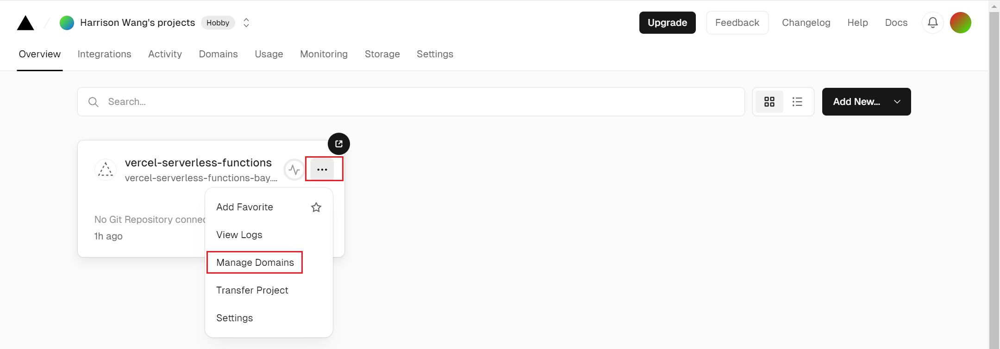
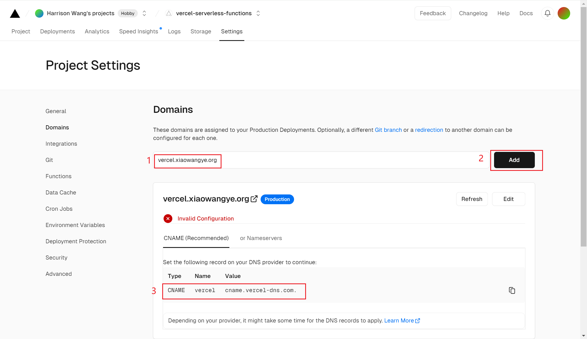
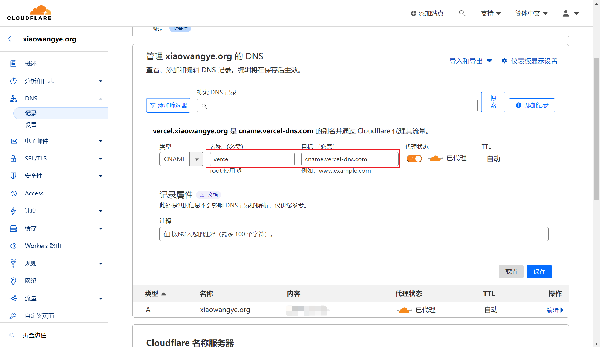

Vercel 的 Serverless Functions 允许我们使用 Golang、Node.js、Python、Ruby 语言编写，然后可以通过 API 访问。

本文使用 Node.js 搭建 [Vercel 的 Serverless Functions](https://vercel.com/docs/concepts/functions/serverless-functions)。

## 前提条件

- 一个 Vercel 账号
- 了解 Node.js 和 TypeScript 基础知识

## 操作步骤

### Step 1：新建项目目录

```bash
$ mkdir vercel-serverless-functions
```

### Step 2：安装 Vercel CLI

Vercel 提供了 CLI，可以方便地部署和使用 Serverless Functions：

```bash
$ npm i -g vercel
```

### Step 3：安装依赖包

```bash
# 切换到 vercel-serverless-functions 目录
$ cd vercel-serverless-functions

# 安装依赖包
$ npm i -D @types/node@16 typescript @vercel/node
```

- **@types/node@16**：提供 Node.js API 的代码提示、类型检查和代码补全等功能

- **typescript**：TypeScript 编译器，将 TypeScript 编译为 JavaScript

- **@vercel/node**：Vercel 团队提供的Node.js 函数的工具和类型定义，在 Vercel 部署 Node.js 无服务器函数时使用

### Step 4：生成 tsconfig.json 文件

```bash
# 使用 npx 命令生成 tsconfig.json 文件
$ npx tsc --int

# 使用 l 命令可查看到名为 tsconfig.json 的文件已生成
$ l
api/  node_modules/  tsconfig.json
```

### Step 5：新建 api 目录并创建 app.js 文件

```bash
$ mkdir api
```

使用 `vim api/app.js` 命令编辑文件并保存：

```ts
import type { VercelRequest, VercelResponse } from '@vercel/node'

export default (request: VercelRequest, response: VercelResponse) => {
  const { name } = request.query
  response.status(200).send(`Hello ${name}!`)
}
```

### Step 6：本地启动服务

键入 `vercel dev` 命令启动：

```bash
$ vercel dev
Vercel CLI 33.0.0
? Set up and develop “~/project/vercel-serverless-functions”? [Y/n] y
? Which scope should contain your project? Harrison Wang's projects
? Link to existing project? [y/N] n
? What’s your project’s name? vercel-serverless-functions
? In which directory is your code located? ./
Local settings detected in vercel.json:
No framework detected. Default Project Settings:
- Build Command: `npm run vercel-build` or `npm run build`
- Development Command: None
- Install Command: `yarn install`, `pnpm install`, `npm install`, or `bun install`
- Output Directory: `public` if it exists, or `.`
? Want to modify these settings? [y/N] n
🔗  Linked to harrison-wangs-projects/vercel-serverless-functions (created .vercel)
> Ready! Available at http://localhost:3000
```

### Step 7：本地服务测试

浏览器访问 http://localhost:3000/api/app?name=Vercel 接口，可以看到成功返回“Hello Vercel!”消息：


### Step 8：发布到 Vercel

```bash
$ vercel --prod
Vercel CLI 33.0.0
??  Inspect: https://vercel.com/harrison-wangs-projects/vercel-serverless-functions/4WR38JWoD5pC8UDQ2B8LmRhiueWx [1s]
✅  Production: https://vercel-serverless-functions-83y10f6fk-harrison-wangs-projects.vercel.app [1s]
```

执行完成后，可以看到 Vercel 给我们生成了一个默认域名 `https://vercel-serverless-functions-83y10f6fk-harrison-wangs-projects.vercel.app`，我们将参数 `name` 拼接上，使用浏览器访问 `https://vercel-serverless-functions-bay.vercel.app/api/app?name=GitHub` 接口，可以看到成功返回“Hello GitHub!”消息：


### Step 9：绑定自定义域名

打开 Vercel 地址，选中 vercel-serverless-functions 项目，点击 Manage Domains：



添加自定义域名 `vercel.xiaowangye.org`：



然后我们将 Vercel 提供的 CNAME 记录，添加到 Cloudflare DNS 记录：



DNS 记录设置完成后，我们可通过地址 `https://vercel.xiaowangye.org/api/app?name=world` 访问到接口：

```bash
$ curl https://vercel.xiaowangye.org/api/app?name=world
Hello world!
```

> 出现 `DNS_PROBE_FINISHED_NXDOMAIN` 错误，是因为 DNS 同步到国内需要时间，请稍等一段时间后重试。

## 总结

Vercel Serverless Functions 适用于构建轻量级、可伸缩、易于部署的服务和功能，特别适合快速原型开发和构建无服务器应用。

本文示例仓库地址：[https://github.com/HarrisonWang/vercel-serverless-functions.git](https://github.com/HarrisonWang/vercel-serverless-functions.git)
